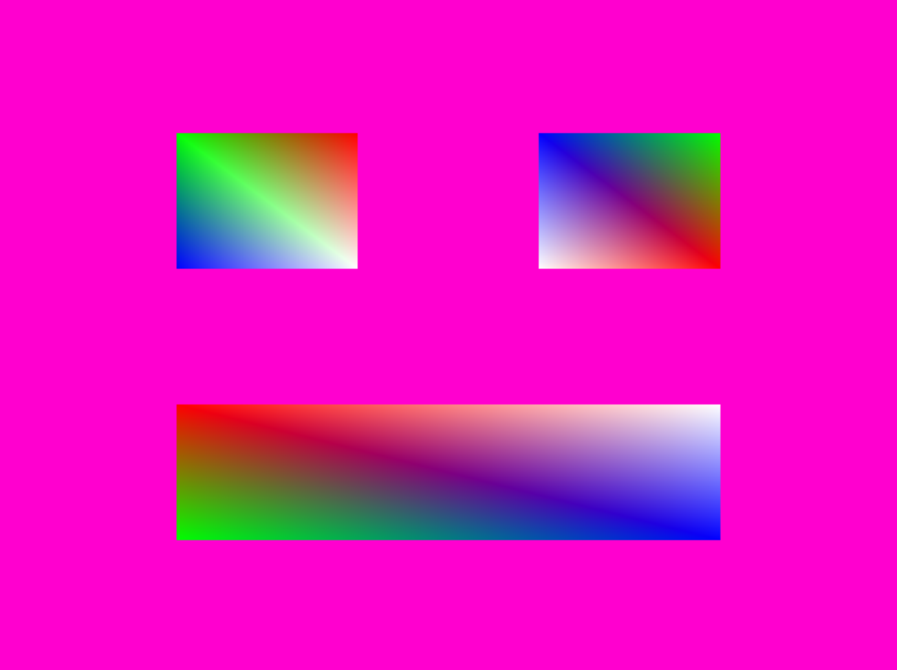

# Simple Graphic Engine
C++/OpenGL로 구현한 그래픽스 파이프라인 학습 프로젝트 — 래스터라이저부터 카메라 프러스텀까지 직접 구현.



  

## Features

- **2D/3D 아핀 변환** — 행렬을 직접 구현해 이동·회전·스케일을 합성
- **소프트웨어 삼각형 래스터라이저** — 픽셀 단위 삼각형 채우기 및 Z-버퍼 기반 깊이 테스트
- **카메라 & 프러스텀 클리핑** — 뷰·프로젝션 행렬 구성, 반공간(half-space) 기반 폴리곤 클리핑
- **텍스처 매핑 & 보간** — UV 보간, BMP/PNG 텍스처 로딩 및 래스터 단계 적용
- **다양한 메시 지원** — Cube, SnubDodecahedron, Frustum 등 절차적 메시 생성

## Demo


## Built With

- **C++** — 외부 게임 엔진 없이 그래픽스 수학과 파이프라인을 직접 제어하기 위해 선택
- **OpenGL + GLEW** — GPU 래스터라이저와 소프트웨어 구현을 비교·검증하는 레퍼런스 렌더러로 활용
- **SDL2** — OS 창 생성 및 OpenGL 컨텍스트 관리, 입력 처리
- **GLSL** — 셰이더 단계별 동작(패스스루, 모델→NDC 변환, 텍스처 샘플링)을 분리해 실험
- **ImGui** — 런타임 파라미터 조작을 위한 디버그 UI
- **stb_image** — 단일 헤더로 PNG·BMP 텍스처 로딩

## Getting Started

### Prerequisites

- Windows 10 이상
- Visual Studio 2019 이상 (C++ 데스크톱 개발 워크로드 포함)

### Installation

```bat
git clone https://github.com/Git-Mere/simple-graphic-project.git
```

1. `cs200-opengl-dev-Seungheon-digipen-master/opengl-dev.sln` 을 Visual Studio로 열기
2. 실행할 프로젝트(예: `camera_frustum`, `tutorial-5`)를 시작 프로젝트로 설정
3. **빌드 → 솔루션 빌드** (필요한 SDL2·GLEW DLL은 프로젝트 디렉터리에 포함되어 있음)
4. **디버그 → 디버깅 시작** 으로 실행

## What I Learned

**아핀 행렬 직접 구현 — "왜 순서가 바뀌면 결과가 달라지는가"**

TRS(Translation·Rotation·Scale) 행렬 합성 순서를 코드로 틀렸을 때, 오브젝트가 예상과 전혀 다른 위치에 그려지는 문제를 겪었다. `Affine.cpp`에서 행렬 곱 순서를 명시적으로 추적하며 열 우선(column-major) 레이아웃과 연산 순서가 왜 분리되는지 직접 확인했다. 이후 `AffineTest` 블랙박스 테스트를 통과시키는 과정에서 수학 공식과 GPU 메모리 레이아웃 사이의 간극을 구체적으로 파악했다.

**Z-버퍼 없는 래스터라이저의 한계 — 깊이 정렬 문제**

`TriangleTest.cpp`에서 깊이 없이 삼각형을 그렸을 때 뒷면이 앞면을 덮어쓰는 현상을 마주쳤다. `TriangleZTest.cpp`에서 픽셀마다 Z값을 비교하는 깊이 버퍼를 추가하면서, 버퍼 초기화 시점과 클리어 주기가 틀리면 잔상이 남는다는 것을 실패를 통해 배웠다.

**프러스텀 클리핑 — 반공간 교차 판별**

`HalfSpace.cpp`와 `Clip.cpp`를 구현하면서, 프러스텀 6면 각각에 대해 폴리곤 꼭짓점이 안쪽/바깥쪽 어느 반공간에 있는지 판별하고 교점을 보간해 새 꼭짓점을 생성해야 한다는 것을 배웠다. 클리핑 후 텍스처 UV도 동일한 비율로 보간하지 않으면 텍스처가 왜곡된다는 점은 `TextureClipTest`를 통과시키는 과정에서 발견했다.

## License

라이선스 정보가 저장소에 명시되어 있지 않습니다. 사용 전 저자에게 문의하세요.